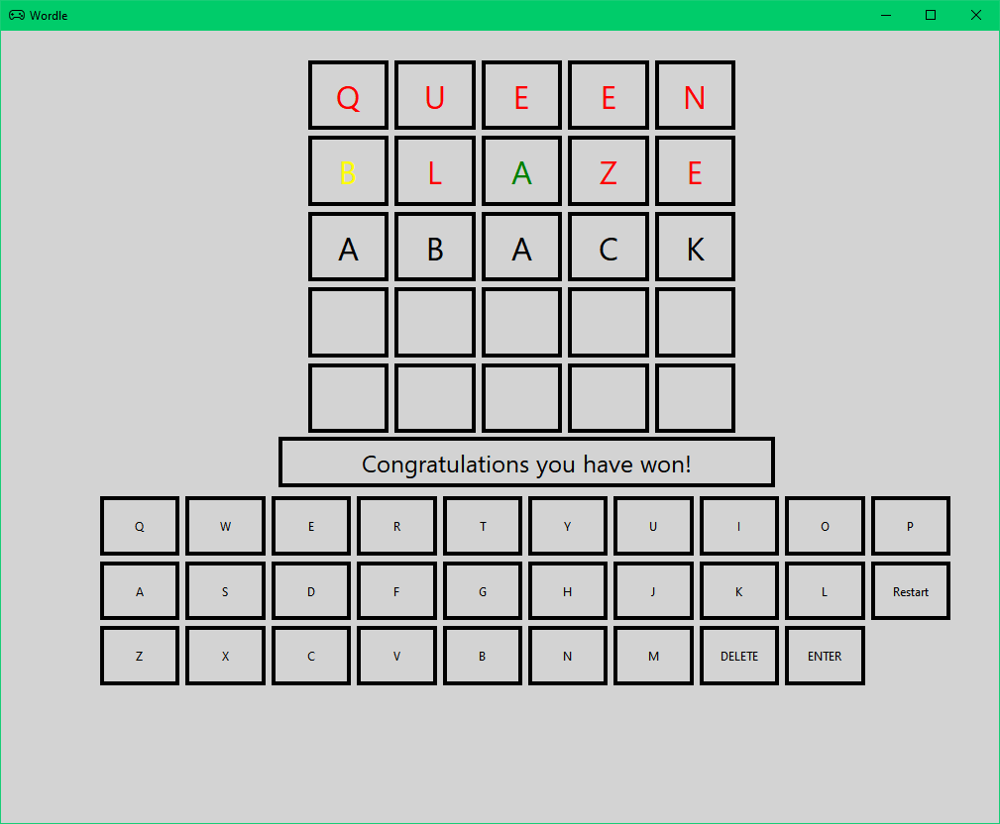

# Simple C++ Wordle game using QT library

# Requirements
-   CMake 3.5 or newer
-   C++ compiler supporting C++ 17
-   Git
-   Qt6

# Installation
-   Clone the repository into desired place
-   Create "build" directory inside the repo
-   Using command prompt (terminal, powershell ...) go to the build directory with "cd (path)" command
-   Type cmake ..
-   Type cmake --build .
-   After the installation game should be located build directory
-   Move "words.txt" to the directory where game is located

# Screenshots

